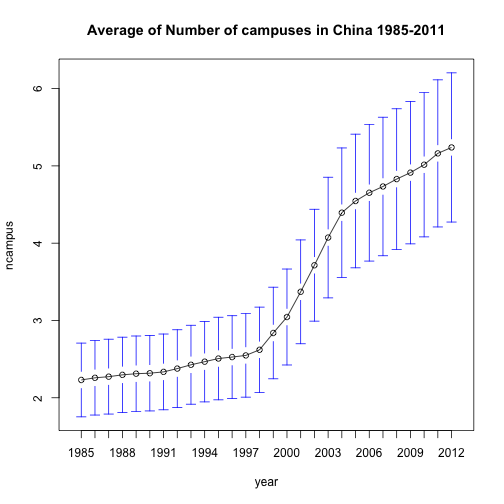

Midterm Presentation
========================================================
author: Junyan Yao
date: March 20,2017
autosize: true

-Project Questions

-Theoretical Model

-Data

-Primary Analysis


College Expansion in China
========================================================


Only balanced investment in human capital and physical capital can yield rapid economic development. 

Pros

Human Capital Accumulation

Easing pressure of secondary school graduates on the labor market

Questions:

Can China's expansion stimulate longer term ecopnomic development?/Was College Expansion Worthwile?

May increasing the unemployment rate among college graduates???


Baseline Thereotical model
=======================================================
Stage #1 (What are the factors affecting the college expansion)

Let Y be the number of campuses in the area give the year, and let X be the collection of covariates, which could be the development indicators.

X = (X_{1},X_{2}, X_{3}, ... ,X_{p})

E(Y |X =x) = β0 + β1X1 . . . βpXp

Stage #2 (what's the economic outcomes it may affect)

Let Y be the lagged development indicators (especially the unemployment rate and average wage) and let X be the number of campuses, shares of technology schools, shares of comprehesive schools....


Data
=========================================================

Time Period: 1985-2011

Source:

-National Bureau of Statistics of China(NBS) 


-CNKI

=========================================================

```r
library(foreign)
edat<- read.csv("~/Desktop/edsproject/data_cleaned.csv")
dat<- read.dta("~/Desktop/edsproject/china_univ_by_municipality.dta")
total<- merge(edat, dat, by=c("cityid", "year"))
#recode the category
citycateg<-c(0,1)
total<-cbind(total, citycateg)
total$citycateg[total$citycat=="City in prefecture"] <- 0
total$citycateg[total$citycat=="City outside prefecture"] <- 0
total$citycateg[total$citycat=="prefecture"] <- 0
total$citycateg[total$citycat=="Prefecture=urban core"] <- 0
total$citycateg[total$citycat=="Prefecture=urban core"] <- 1
total$citycateg[total$citycat=="Urban core"] <- 1
```
Number of Campuses Across Time
=====================================================

```r
library(gplots)
plotmeans(ncampus~year, main="Average of Number of campuses in China 1985-2011", n.label= FALSE, data=dat)
```



Data
======================================================


```r
aggregate(ncampus ~ citycateg, data=total, mean)
```

```
  citycateg   ncampus
1         0 0.9398111
2         1 5.0122001
```
Data
=======================================================

```r
aggregate(ncampus ~ provcat, data=total, mean)
```

```
  provcat  ncampus
1       1 4.732673
2       2 3.897482
3       3 3.473282
4       4 3.451941
5       5 2.898466
6       6 3.944262
```

```r
plotmeans(ncampus~provcat, main="Average of Number of campuses in China 1985-2011, by Region", n.label= FALSE, data=total)
```


Bivariate Relationship plot for Perfecture level (standardized) --Development Indicators,2010
========================================================


Bivariate Relationship plot for Urban Core Level (standardized)--Development Indicators,2010
========================================================


Potential Cluster Solution
========================================================


```r
par(mfrow=c(1,3))
hcl.single<- hclust(dist(scale(only2010[,7:14])),meth="single")
plot(hcl.single)

hcl.complete <- hclust(dist(scale(only2010[,7:14])), meth="complete")
plot(hcl.complete)

hcl.ward<-  hclust(dist(scale(only2010[,7:14])), meth="ward")
plot(hcl.ward) 
```


Primary analysis---Perfecture level
========================================================

```r
library(plm)
fe1<- plm(ncampus ~ lgdptota+poptota+fditota+wgavea, index=c("cityid","year"), data=total)
```

```
This series is constant and has been removed: sample
```

```r
summary(fe1)$coefficient
```

```
              Estimate   Std. Error    t-value     Pr(>|t|)
lgdptota  1.933851e-07 1.807923e-08 10.6965386 7.689816e-26
poptota  -6.427979e-04 1.716354e-04 -3.7451356 1.866780e-04
fditota   9.273274e-07 1.005294e-06  0.9224435 3.564362e-01
wgavea    9.879261e-05 1.339746e-05  7.3739782 2.643877e-13
```
Primary Analysis---Urban Core
=======================================================

```r
fe2<- plm(ncampus ~ lgdptotc+poptotc+fditotc+wgavec, index=c("cityid","year"), data=total)
```

```
This series is constant and has been removed: sample
```

```r
summary(fe2)$coefficient
```

```
              Estimate   Std. Error   t-value     Pr(>|t|)
lgdptotc  1.454348e-07 2.525278e-08  5.759161 1.002212e-08
poptotc  -1.572946e-03 6.600859e-04 -2.382942 1.728485e-02
fditotc  -1.177665e-06 8.107334e-07 -1.452592 1.465227e-01
wgavec    1.354407e-04 1.200135e-05 11.285456 1.578106e-28
```

Next Steps
========================================================

Week8: More cluster analysis

Week9: Model Selection for Stage #1

Week 10: Model Selection for Stage #2
